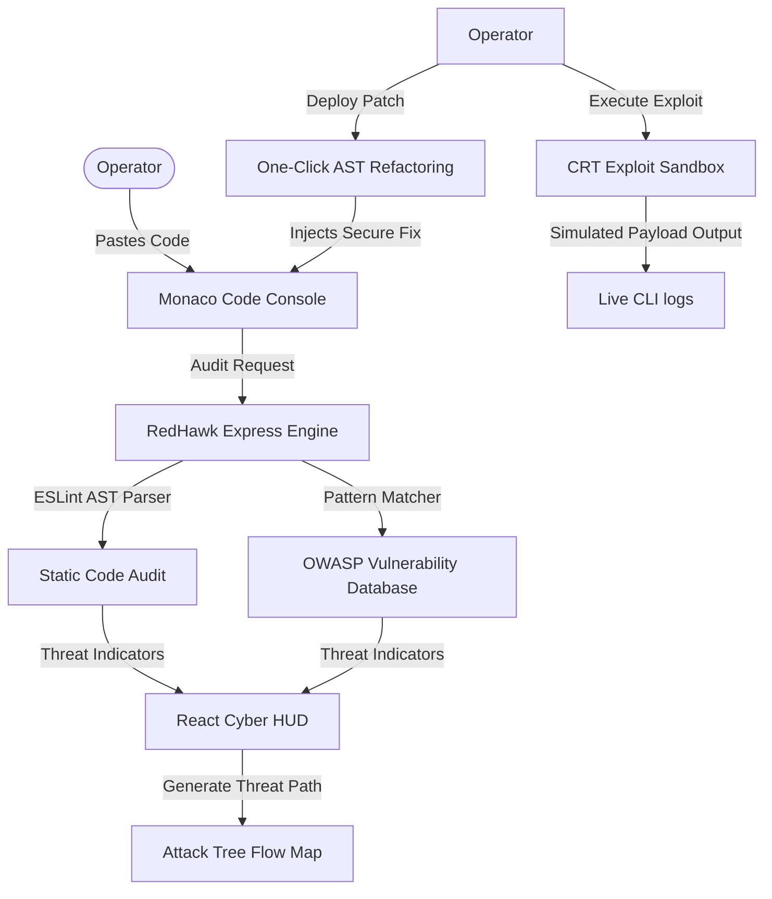

# <h1 align="center">🛡️ REDHAWK AI – Cyber Reconnaissance & Code Vulnerability Suite</h1>

<p align="center">
  
  
  
  
</p>

<p align="center">
  
</p>

---

## ⚡ Executive Summary
**RedHawk AI** is a state-of-the-art hacker-themed security operations dashboard built to streamline manual pre-engagement reconnaissance and automate code security audits. Combining active OSINT probes (WHOIS, DNS, TCP Port scans, subdomain enumeration) with a local static analysis engine (AST parser), it provides a complete end-to-end vulnerability workflow: **Discovery ➔ Visualization ➔ Exploitation Simulation ➔ Automated Remediation**.

Point this tool at a repository or domain target to generate threat paths, witness live container-sandbox exploit sessions, and deploy instant, one-click secure refactoring directly inside an integrated Monaco Editor.

---

## 🧬 Architectural Workflow
The flowchart below illustrates how RedHawk AI coordinates telemetry scans, threat modeling, and code refactoring:



---

## 🎯 Key Features & Capabilities

### 1. Active Reconnaissance Pipeline
*   **WHOIS Mapping:** Queries domain registrar records, organizational metadata, and hosting location nodes.
*   **DNS Enumeration:** Automatically sweeps and parses **A**, **MX**, and **TXT** records.
*   **Port Scanner:** Scans standard web ports (SSH, HTTP, HTTPS, MySQL, Tomcat alt) for exposure.
*   **Subdomain Sweep:** Enumerates subdomains matching active DNS bindings (e.g. `dev.target`, `admin.target`).

### 2. AI Attack Surface Analyzer
*   **Threat Parser:** Evaluates raw recon telemetry to flag exposed CMS installations, server software versions, and structural weak spots.
*   **Intelligence Output:** Compiles a terminal-formatted threat report detailing risk levels and mitigation instructions.

### 3. OWASP Vulnerability Static Scanner
*   Checks code buffers against common OWASP vectors: SQL Injection, command exec strings, DOM XSS (`innerHTML`), hardcoded Stripe keys, and weak random number generation.

### 4. Interactive Attack Tree Flow
*   Renders dynamic, node-based compromise paths using SVG paths. Highlights connection nodes in glowing red to display chained entry vectors from user input to root shell execution.

### 5. Exploit Sandbox Playground
*   Simulates container-level penetration payloads (e.g. dumping database hashes via SQL injection or stealing sessions via XSS hooks) inside a CRT screen-flicker log terminal.

### 6. One-Click Safe Refactoring
*   AST-based code patches automatically replace vulnerable calls (e.g., parameterizing MySQL statements, swapping `eval()` to `JSON.parse()`) inside the Monaco editor in real time.

---

## ⚙️ Core Technology Stack
*   **Client Core:** React 18, TypeScript, Vite
*   **Visual Framework:** Tailwind CSS, Lucide icons, Custom CRT scanline styling
*   **Editor Engine:** Monaco Editor (VS Code core API)
*   **Documentation Core:** jsPDF, jsPDF-AutoTable (PDF compilation)
*   **Audit Engine:** Node.js, Express, ESLint API

---

## 🛠️ Installation & Setup

Ensure you have **Node.js** (v16+) installed.

### 1. Clone the Repository
```bash
git clone https://github.com/SriVishnu-999/RED-HAWK-AI-Automated-Reconnaissance-Intelligence-Tool-.git
cd RED-HAWK-AI-Automated-Reconnaissance-Intelligence-Tool-
```

### 2. Install Project Dependencies
```bash
npm install
```

### 3. Launch Backend Operations (Terminal 1)
```bash
node src/server.js
```
*Port: `http://localhost:3001`*

### 4. Start Client Development HUD (Terminal 2)
```bash
npm run dev
```
*Port: `http://localhost:5173`*

---

## 📸 Guided Interview Demo Walkthrough

Walk the interviewer through this end-to-end security audit pipeline:

1.  **Entrance:** Open the page. Show the canvas-based **Matrix digital rain overlay** and the typing intro CLI. Click **Launch Guest Simulator** to bypass login.
2.  **Asset Recon:** Select the **Recon Pipeline** tab. Enter a domain (e.g. `target.com`) and click **RUN PIPELINE**. Show the open port cards and DNS tables.
3.  **LLM Report:** Click **RUN LLM REPORT** to generate the attack surface report flagging exposed CMS instances.
4.  **Static Scan:** Switch the preset dropdown to **Vulnerable SQLi & Command Injection**. Go to **Security Scans** and click **INJECT SCANNER** to highlight vulnerabilities.
5.  **Threat Map:** Navigate to **Attack Paths** to show the flashing compromise diagram.
6.  **Simulation & Remediation:** Click the SQL Injection vulnerability card. Click **Execute Exploit** to watch live credential dumps, then click **Deploy Patch** to watch the Monaco editor automatically refactor the insecure code.
7.  **Documentation:** Click **EXPORT REPORT** to download a compiled PDF audit report listing all vulnerabilities, port states, and the AI threat analysis.

---

> ⚠️ **Disclaimer:** This tool is designed strictly for defensive education, portfolio presentation, and security auditing demonstrations. Always obtain authorization before scanning target assets.
